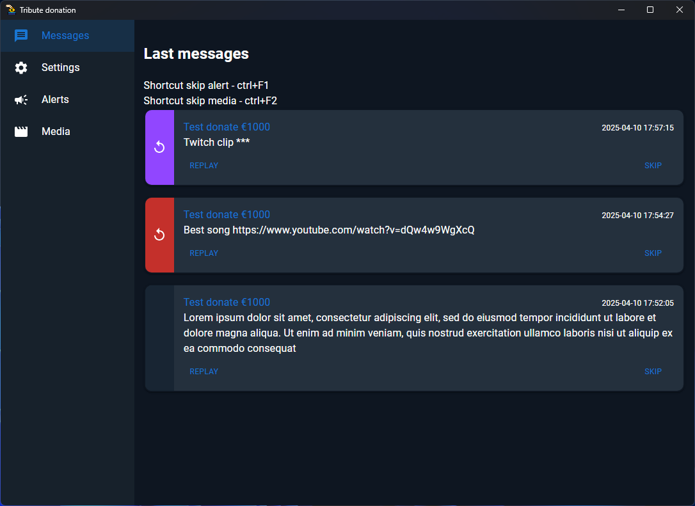

# Widy

Widy is a platform for streamers that provides a unified alert and widget system across multiple services and platforms.
It aggregates events from different sources, normalizes them into a single format, and delivers consistent alerts for overlays and streaming tools.

## Screenshot

Here’s a preview of the application:




## Development

### Prerequisites
Ensure you have the following installed on your system:
- [Node.js](https://nodejs.org/) (LTS version recommended)
- [Rust](https://www.rust-lang.org/tools/install)

To install and run the project locally, follow these steps:

1. Clone the repository:
   ```
   git clone https://github.com/ik1s3v/widy.git
   cd widy
   ```

2. Install dependencies:
   ```
   npm install
   ```
3. Аill .env with environment variables
4. Start the development:
   ```
   npm run tauri dev
   npm run widget:dev
   ```

## Build

 Build the Tauri application:
   ```
   npm run build:production
   ```

The production-ready files will be available in the `src-tauri/target/release` directory.

## License
This project is licensed under the [MIT License](LICENSE).

## Contact
For questions or feedback, please contact Discord ik1s3v.